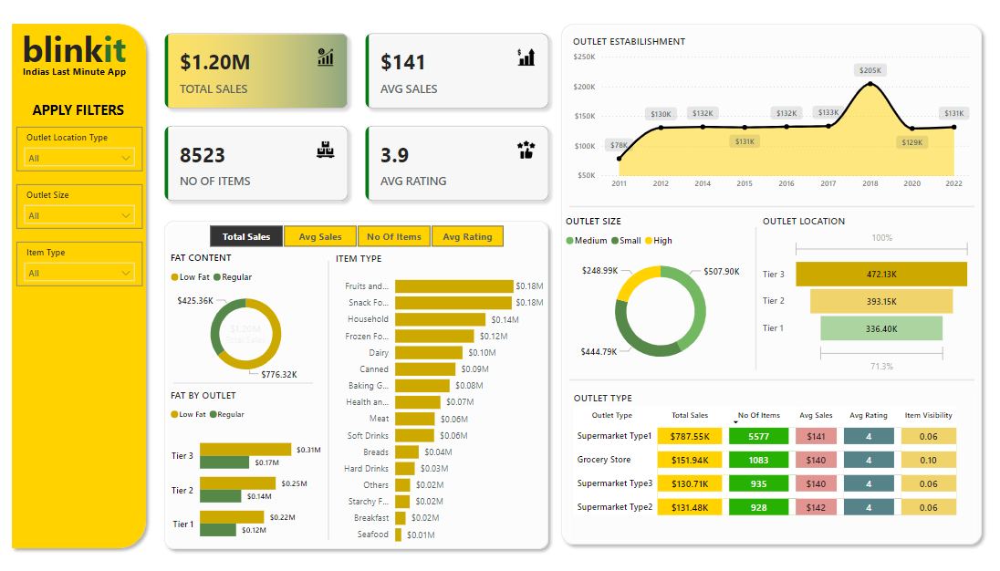

# Blinkit Sales Analysis Dashboard 📊

This project showcases a **dynamic and interactive sales analysis dashboard** for Blinkit, India's leading last-minute delivery app. Designed using **Power BI**, the dashboard provides a **comprehensive overview** of sales performance, empowering businesses to uncover critical insights for growth and optimization.

---

## Key Insights and Features
- **Total Sales Overview**: Achieved an impressive **$1.20M in total sales**, with key performance metrics including an **average sale of $141** and a **customer rating of 3.9**.
- **Diverse Product Range**: Displaying sales for **8,523 unique items**, offering insights into Blinkit's extensive product portfolio.
- **Growth Trends**: A time-series analysis of outlet establishments reveals a **significant peak in 2018**, marking a phase of exponential growth.
- **Consumer Preferences**:  
   - Sales by **Fat Content**: Regular Fat products led with **$776.32K**, compared to **$425.36K** for Low Fat.  
   - Top-performing **Item Types** include Fruits & Vegetables and Snack Foods, each contributing **$0.18M** in sales.
- **Outlet Performance**:  
   - By **Location**: Tier 3 cities dominate with **$472.13K in sales**, underscoring their potential as key markets.  
   - By **Size**: Medium-sized outlets excelled, generating **$507.90K** in sales.  
   - **Outlet Type**: Supermarkets emerged as the top contributors with a revenue of **$787.55K**.
- **Advanced Visualizations**: Utilizes pie charts, bar graphs, and donut charts to provide an **intuitive and visually compelling analysis** of sales metrics.

---

## Interactive Capabilities
The dashboard is equipped with a **custom filter panel** that enables users to slice data by:
- Outlet **Location Type**
- Outlet **Size**
- Product **Categories**

This enhances usability, allowing stakeholders to generate **customized insights** tailored to strategic goals.

---

## Project Highlights
- **Data-Driven Storytelling**: Delivers actionable insights by integrating diverse metrics into an engaging and easy-to-understand dashboard.
- **User-Centric Design**: The interactive interface ensures an intuitive exploration of data, maximizing its value for decision-making.
- **Strategic Business Impact**: Helps identify key revenue drivers, customer preferences, and market opportunities, positioning Blinkit for **sustainable growth**.

---

### Why This Project Matters 🚀
This Power BI dashboard demonstrates expertise in **data visualization, advanced analytics, and actionable business intelligence**. It serves as a prime example of how to transform raw sales data into meaningful insights that drive **strategic decision-making**.

Feel free to explore this project and let me know your thoughts!
